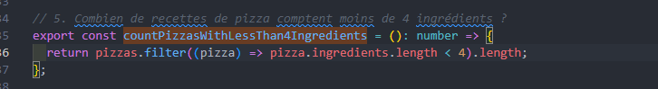

# FunctionalPizzas 

Ce projet est une application de gestion de pizzeria implémentée en **TypeScript** et basée sur la **programmation fonctionnelle**. Le but est de simplifier la gestion des commandes et la préparation des pizzas pour un établissement pendant des périodes de forte affluence. Voici les concept appliqués:

**Immutabilité:**
Les données ne sont pas modifiées directement. Les transformations des tableaux et des objets produisent de nouvelles structures de données sans affecter les originaux.
Exemple:

**Pureté des Fonctions:**

Les fonctions pures produisent toujours les mêmes résultats pour les mêmes entrées, sans effets secondaires.
Exemple :

**Fonctions d'Ordre Supérieur:**
Les fonctions d'ordre supérieur comme map, filter, reduce et flatMap sont largement utilisées pour transformer les données.
Exemple :

**Composabilité:**
Combine plusieurs petites fonctions pour créer des opérations complexes.
Exemple :

**Fonctionnalités**

- Gestion des commandes (commande, livraison, préparation)
- Calcul du montant moyen des commandes
- Identification des pizzas les plus commandées
- Temps de préparation moyen des commandes
- Suivi des ingrédients utilisés et non utilisés

**Prérequis**

Avant de commencer, assurez-vous d'avoir **Bun** installé sur votre machine.

**Installation de Bun**

'curl https://bun.sh/install | bash'

**Installation du projet :**
Clonez le dépôt et installez les dépendances :

'git clone https://github.com/DH-HUB/FunctionalPizzas.git'

cd FunctionalPizzas

'bun install'

Scripts disponibles 
Démarrer l'application : bun run start
Construire le projet : bun run build
Exécuter les tests : bun run test
Formater le code : bun run format
Lint du code : bun run lint
Nettoyer le projet : bun run clean

**lancer le programme :**

'bun run start'
**Exemple de sortie :**

**Lancer les tests:**
'bun run test'
**Exemple de sortie :**

**Explications :**
- **Présentation** : Le projet est décrit de manière succincte, avec les fonctionnalités principales mises en avant.
- **Prérequis et installation** : Instructions pour installer **Bun** et le projet.
- **Scripts disponibles** : Fournit des informations utiles sur les différentes commandes **Bun**.
- **Structure du projet** : Aperçu de l'architecture du projet pour une meilleure compréhension.
- **Contributions** : Encourage les contributions via issues ou pull requests.
  
Structure du projet 

**Contributions*
Les contributions sont bienvenues ! Pour toute suggestion ou amélioration, ouvrez une issue ou soumettez une pull request.

**Auteur:**
Hakima Djermouni

**Licence:** 
Ce projet est sous licence MIT. Consultez le fichier LICENSE pour plus d'informations.